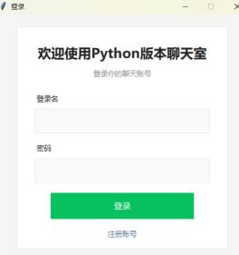
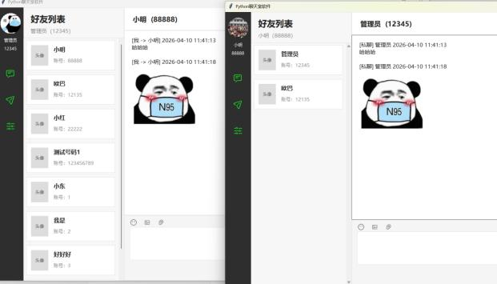
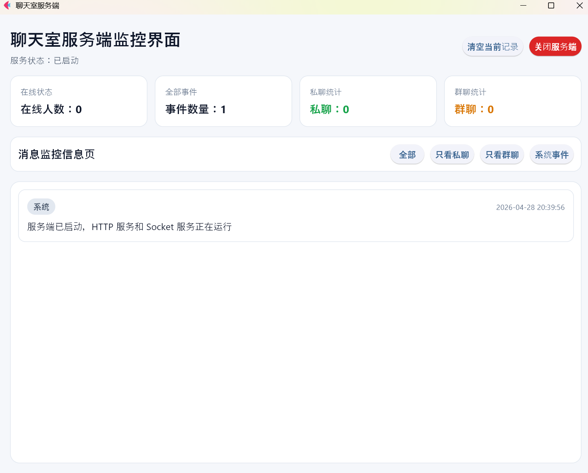

# 💬 Python Chat Room（即时通讯聊天系统）

一个基于 **Python + Flet/Tkinter + Socket + HTTP + MySQL + 阿里云OSS** 实现的两种ui桌面端即时通讯系统，支持私聊、群聊、图片发送、表情、未读消息提示等功能，UI 风格参考微信。

---

## 🚀 1 项目特点
* ✅ 两种UI / 有Tkinter和Flet两种框架的客户端界面
* ✅ 私聊 / 群聊实时通信（Socket）
* ✅ 登录 / 注册 / 修改个人信息（HTTP + MySQL）
* ✅ 好友管理（添加 / 删除）
* ✅ 群聊管理（创建 / 加入 / 退出 / 删除）
* ✅ 表情面板
* ✅ 图片发送与展示
* ✅ 未读消息红点提示
* ✅ 会话隔离（不同聊天对象独立缓存） 
* ✅ 系统消息提示（删除好友 / 群聊等）
* ✅ 头像上传（阿里云 OSS 存储）

---

## 🧱 2 技术架构

### 整体架构

```
客户端（Tkinter GUI）                          客户端（Flet GUI）
    ↓ HTTP（登录 / 注册 / 数据操作）                 ↓ HTTP（登录 / 注册 / 数据操作）
HTTP Server（Flask）                          HTTP Server（Flask）
    ↓                                            ↓
MySQL 数据库                                   MySQL 数据库                             


                              客户端
                                  ↓ Socket（实时通信）
                              Socket Server
```

---

## 🛠 3 技术栈

### 后端

* Python
* Flask（HTTP服务）
* Socket（长连接通信）
* MySQL（数据存储）

### 前端（桌面）

* Tkinter（GUI界面）
* Flet（GUI界面）

### 存储

* 阿里云 OSS（头像存储）

---

## 📂 4 项目结构（简化）

```
client_flet/
│
├── app.py                     # 主客户端-启动
├── controller.py              # 控制逻辑
├── login_view.py              # 登录界面
├── register_view.py           # 注册界面
├── main_view.py               # 主界面（微信风格UI）
├── update_info_view.py        # 修改个人信息页面
├── client_http_services_v2.py    # HTTP请求封装
├── socket_service_v2.py          # Socket通信封装
└── message_service_v2.py         # 消息缓存 & 未读管理

client_tkinter/
│
├── client.py                  # 主客户端逻辑-启动
├── login_window.py            # 登录界面
├── register_window.py         # 注册界面
├── main_window.py             # 主界面（微信风格UI）
├── update_info_window.py      # 修改个人信息页面
├── client_http_services_v1.py    # HTTP请求封装
├── socket_service_v1.py          # Socket通信封装
└── message_service_v1.py         # 消息缓存 & 未读管理

server/
│
├── http_server.py             # Flask接口
├── socket_server.py           # Socket服务
└── database.py                # 数据库操作

```

---

## 📌 5 核心功能说明

### 🔐 登录 / 注册（HTTP）

* 使用 Flask 提供 REST API
* 密码加密存储（hash）
* 登录成功后返回用户信息

---

### 💬 实时聊天（Socket）

* 使用 TCP Socket 长连接
* 支持：

  * 私聊（point-to-point）
  * 群聊（broadcast）


---

### 🧑‍🤝‍🧑 好友系统

* 添加好友（双向关系）
* 删除好友（双向删除）
* 删除后：

  * 禁止继续发送消息
  * 客户端收到系统提示

---

### 👥 群聊系统

支持：

* 创建群聊
* 加入群聊
* 退出群聊
* 删除群聊（仅群主）


---

### 🖼 图片发送

流程：

1. 客户端选择图片
2. 转为 Base64 编码
3. 通过 Socket 发送
4. 接收端解码并显示

---

### 😊 表情系统

* 自定义 Emoji 面板
* 点击表情直接发送
* 表情作为文本处理

---

### 🔴 未读消息

* 每个会话维护未读计数
* 切换会话自动清零
* UI 显示红点提示

---

### 🧠 会话缓存机制

使用：

```python
chat_cache = {
    "private_1001": [...],
    "group_2001": [...]
}
```

实现：

* 不同聊天对象消息隔离
* 切换聊天自动加载历史内容

---

### 🖼 头像上传

* 用户上传头像
* 服务端上传至阿里云 OSS
* 数据库存储 `object_key`
* 前端通过 URL 加载头像

---


## 📸 6 界面展示(tkinter版本)
登录页



注册页


主界面



---

## 📸 7 界面展示(flet版本)

登录页


注册页


主界面


修改页


---
## 📸 8 界面展示(flet版本)

服务端页面



---
## 📸 9 运行流程

* 数据库--提前创建对应数据库
* 服务端--方式1：开启http_server、socket_server    方式2：直接开启server_ui
* 客户端--多应用开启client.py或app.py


---
## 🚧 10 后续可优化方向

* ⏳ 离线消息（未实现）
* 📦 添加好友需确认
* 🔔 消息通知系统
* 🧾 聊天记录持久化（数据库）
* 🎨 UI 和交互动画优化（更接近微信）
* 📦 代码逻辑进一步解耦，面向工程化
---

